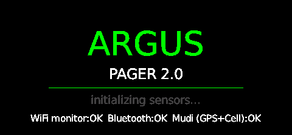
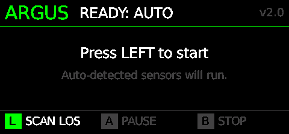
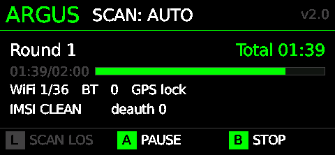
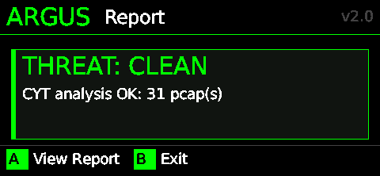

# argus-pager 2.0

**Counter-Surveillance auf dem WiFi Pineapple Pager.** Ein Tool das passiv und mobil
die Frage beantwortet: *"Wer überwacht mich gerade — und wie?"*

<p align="center">
  
  &nbsp;
  
</p>
<p align="center">
  
  &nbsp;
  
</p>

---

## Was kann das Ding

argus-pager 2.0 vereint vier Quellen auf einem Hardware-Stack
(Pineapple Pager + GL-E750 Mudi V2):

- **WiFi / Bluetooth** — wer pingt mich an, wer folgt mir
- **Cellular / GSM-Layer** — bin ich gerade an einem IMSI-Catcher
- **Aktive Funkangriffe** — werde ich gerade vom Netz geworfen
- **Externe Intel** — InternetDB / Shodan / Fingerbank / OpenCelliD

| Bedrohung | Detektor | Quelle |
|---|---|---|
| Apple AirTag, Samsung SmartTag, Tile, Chipolo | BT-Tracker | BLE-Adv |
| Stalker via persistenter Probe-MAC ueber mehrere Sessions | Cross-Report | WiFi-Probe |
| WiFi/BT-Pairing eines mobilen Verfolgers | Pairing-DB | WiFi+BT |
| **Deauth-Flood-Angriff aktiv** | Deauth-Watcher | 802.11 mgmt |
| IP-Kamera / NVR / IoT-Device im Hotelzimmer | Fingerbank-Lookup | DHCP, MAC |
| Aktive Spy-Cam (Bandbreiten-Spike) | Camera-Activity | PCAP |
| **IMSI-Catcher / Stingray** (RAT-Downgrade, TA-Anomalie) | IMSI-Monitor | AT+QENG |
| **Silent-SMS / Stille SMS** (Standortpeilung) | SMS-Watch | AT+CMGL |
| Cell-Tower Spoofing (Cell-ID-Mismatch / nicht in DB) | OpenCelliD-Lookup | API |
| Public-IP mit bekannter CVE / verdächtigen Ports | InternetDB / Shodan | API |

---

## Bedienung — Drei Tasten, kein Setup

argus 2.0 hat einen **AUTO-Flow**: kein Preset-Menü, kein Toggle-Screen,
keine Konfiguration im Feld. Der Pager schaut beim Start was an Sensoren
da ist (`sense.discover()`) und scannt dann mit allem was er hat, in
endlosen Runden, bis du STOP drückst.

| Taste | Funktion |
|---|---|
| **LEFT** | SCAN LOS (im IDLE) / Resume (im PAUSE) |
| **A** (grün) | PAUSE (während RUNNING) / View Report (im Report) |
| **B** (rot) | STOP / Exit |
| **POWER / lang B** | Notbeenden überall |

### Ablauf

1. **Splash** — Sensor-Self-Check (WiFi-Monitor, BT, Mudi, GPS, Cell, IMSI-Watcher, SMS-Watch).
2. **Ready: AUTO** — `LEFT` startet den Scan.
3. **Live-Scan** — Round-Counter, ETA-Bar, Live-Counter (WiFi probes, BT, GPS, IMSI, deauth).
   - **A** = Pause/Resume — der Background-Watcher (IMSI/SMS) läuft weiter.
   - **B** = STOP. Confirm-Modal: weiter oder beenden.
4. **Saving report** — analyser fügt CYT-Body, Pairing-DB, External Intel,
   Cellular-Block + Threat-Summary zusammen (typ. ~30-60s).
5. **Rotate IMEI?** — opt-in Confirm-Modal mit 10s Timeout-default-NO.
   `LEFT` = YES (Mudi rebootet, ~30-60s offline), `B` = NO direkt zum Report.
6. **Report-Card** — Threat-Level + Top-Findings.
   - **A** = Markdown-Report scrollen (UP/DN, B = zurück).
   - **B** = Exit zur Pager-OS.
   - **Auto-Exit nach 60s Idle** — schützt den Akku wenn du den Pager weglegst.

---

## Argus Finder — Walking-Mode RSSI-Tracker

Nach einem Argus-Scan willst du wissen: **wo genau steht das verdächtige Gerät**?
Der Finder ist ein Hot/Cold-Tracker mit Live-RSSI für eine einzelne Ziel-MAC,
gebaut auf demselben pagerctl-Stack wie die Hauptapp (kein DuckyScript-Builtin).

Zwei Modi, eigene Menü-Einträge im Reconnaissance-Menü:

- **`argus-finder`** — BT-Tracker via `btmon`-Live-Stream
- **`argus-finder-wifi`** — WiFi-Probe-Tracker via `tcpdump` auf `wlan1mon`,
  mit 2.4-GHz-Channel-Hopping (1/6/11) damit Probes auf wechselnden
  Kanälen nicht durchrutschen.

### Zwei Modi

Beim Start fragt der Finder, wie du suchen willst:

- **`LEFT` Target-Mode** — du wählst eine **spezifische MAC** aus dem
  letzten Argus-Run und trackst sie live. Gut wenn du genau ein Gerät
  identifizieren willst (z.B. Espressif-Stalker, FritzBox-Repeater).
  *Caveat:* funktioniert nicht für SmartTags / AirTags wenn die
  BLE-Privacy-Adresse zwischen Argus-Scan und Walking-Test rotiert ist.
- **`A` Sweep-Mode** — kein festes Ziel; der Pager **lauscht alle Probes
  / Adverts** in Reichweite und zeigt eine **Live-Top-Liste sortiert nach
  RSSI**. Du läufst durch die Wohnung, beobachtest welche MAC im dB-Wert
  *nach oben* zieht — das ist das Gerät neben dir. Umgeht
  Privacy-Address-Rotation komplett: egal wie oft die Adresse wechselt,
  der nächste Beacon erscheint sofort wieder in der Liste.

### Target-Mode Workflow

1. **Argus-Pager-Scan** läuft → schreibt Report + `bt_<sessid>_*.json`.
2. **Direkt danach Finder starten** → `LEFT` für Target-Mode. Liste wird
   **nur** aus diesem letzten Run gefüllt (Default `last_only=True`).
   Header zeigt `Run 10.05 09:26 (3min alt)` damit du siehst, wie
   frisch die BLE-Adressen sind.
3. **Target wählen** (`UP/DN` scrollen, `LEFT` = OK, `B` = Cancel).
4. **Hunt-Screen** läuft endlos:
   - **Große RSSI-Zahl** + Status (`IM RAUM`/`NAEHER`/`NEBENAN`/`WEIT WEG`)
   - **Bar -100…0 dBm** mit Schwellen-Markern bei -55, -70, -80
   - **30s-Sparkline** glättet das Hot/Cold-Gefühl
   - **LED + Vibration** nach Status (rot/amber/cyan/grün)
   - **`B` = sofort raus**, `poll_input()` alle 50 ms
   - **Auto-Exit nach 5 Min ohne Signal** (Akku-Schutz)

### Sweep-Mode Workflow

1. Finder starten → `A` für Sweep.
2. **Live-Liste** wird sofort gefüllt (egal ob Argus vorher lief).
   Spalten: kurze MAC | RSSI | Sample-Count | Sekunden seit letztem Beacon.
   Stärkstes Signal oben.
3. **Beobachten** statt klicken: durch die Wohnung gehen, Liste schauen
   — welche MAC steigt von -85 auf -55 wenn du in den richtigen Raum
   gehst? Das ist dein Ziel.
4. **LED + Vibration** spiegeln das stärkste Signal in der Liste.
5. **Aging-Out:** MACs die 30 Sekunden nicht mehr beaconen verschwinden
   automatisch — die Liste bleibt aktuell.
6. **`UP/DN`** scrollt, **`LEFT`** springt zurück nach oben, **`B`** = Stop.

### OPSEC im Sweep-Mode

Im Sweep-Mode sieht der Pager **alle BLE/WiFi-Adressen in Reichweite**
deiner Umgebung. Diese erscheinen kurz auf dem LCD, werden aber
**ausschließlich in-memory** verarbeitet:

- **Keine** persistente Logfile mit den MACs
- **Kein** State-File auf der SD-Karte
- Zwischenstand wird beim Exit komplett gelöscht
- Screenshots des Sweep-Screens sind via `.gitignore` von Repo-Commits
  ausgeschlossen — wenn du dokumentieren willst, vorher sanitisieren.

### Schwellen (RSSI in dBm)

| ROT | GELB | BLAU | GRÜN |
|---|---|---|---|
| ≥ -55 — gleicher Raum / Tisch | -55…-70 — Nachbarraum | -70…-80 — durch mehrere Wände | < -80 — Außenbereich/weit |

Genauer in der RSSI-Faustregel weiter unten.

### BLE Privacy Address Caveat

Apple AirTags / Samsung SmartTags rotieren ihre BT-Adresse alle ~15 Min
(RPA = Resolvable Private Address). Der Finder trackt eine **feste** MAC.
Heißt: 30 Min nach dem Argus-Scan ist die Adresse schon weg. Nochmal kurz
Argus laufen lassen (1-2 Min reicht), dann sofort Finder.

### Architektur

```
python/finder/
├── main.py              # Pager-Init, Mode-Wahl, Backend-Routing
├── target_loader.py     # liest letzten Argus-Report + bt-Files (last_only)
├── ui_mode_select.py    # Target/Sweep Auswahl beim Start
├── ui_select.py         # Target-Mode: scrollbare Target-Liste
├── ui_hunt.py           # Target-Mode: RSSI-Display + Sparkline + LED
├── ui_sweep.py          # Sweep-Mode: Live-Top-Liste mit Aging
└── backends/
    ├── wifi_rssi.py     # tcpdump live-stream + Radiotap-Parser-Thread
    └── bt_rssi.py       # btmon live-stream

argus-finder/payload.sh        # Wrapper → main.py --mode bt
argus-finder-wifi/payload.sh   # Wrapper → main.py --mode wifi
```

Beide Backends können entweder mit Target-MAC (BPF-Filter / btmon-Stream-
Match) oder ohne (Sweep) laufen. Im Sweep-Mode queue'n sie
`(mac_lower, rssi)`-Tupel; im Target-Mode nur den `int rssi`. Das hält
den Sampler-Code minimal und vermeidet zwei Subprocess-Pfade.

Die zwei Wrapper-Verzeichnisse liegen im Repo unter `argus-pager-2.0/`,
auf dem Pager als **Symlinks** ins Reconnaissance-Menü:

```sh
ln -s /root/payloads/user/reconnaissance/argus-pager-2.0/argus-finder \
      /root/payloads/user/reconnaissance/argus-finder
ln -s /root/payloads/user/reconnaissance/argus-pager-2.0/argus-finder-wifi \
      /root/payloads/user/reconnaissance/argus-finder-wifi
```

Beide Wrapper suspendieren die Pineapple-UI während des Runs (kill -STOP)
und resumen via `trap restore EXIT INT TERM HUP`. Emergency-Recovery
unter `/root/loot/argus/logs/finder_kill.sh`.

---

## IMEI-Rotation (OPSEC)

Wenn ein Scan einen IMSI-Catcher oder eine andere starke Bedrohung findet, ist
deine IMEI im Modem potenziell schon erfasst. Eine erfasste IMEI gilt netzweit —
der Operator kann dich über die Cell-Towers korrelieren, auch wenn du SIM oder
Standort wechselst.

argus bietet deshalb **opt-in IMEI-Rotation** über
[Blue Merle](https://github.com/srlabs/blue-merle) auf dem Mudi V2:

1. Modem-Radio off (`AT+CFUN=4`) — alte IMEI leakt nicht weiter.
2. Rotate — Blue Merle generiert eine neue IMEI (deterministisch aus IMSI-Hash).
3. Modem-Radio on (`AT+CFUN=1`) — neue IMEI ist live.

**OPDEC-Hinweis:** IMEI-Rotation allein hilft nicht gegen alle Korrelations-
Vektoren. Wer auch *operative Sicherheit* (OPSEC) ernst nimmt, kombiniert:

- **SIM-Swap im selben Schritt** (Modem ist eh schon Radio-off).
- **Standortwechsel** zwischen alter und neuer IMEI (sonst kann ein passiver
  Beobachter die Übergabe am gleichen Cell-Tower mitloggen).
- **MAC-Randomisierung** auf den WLAN-Interfaces.
- **Bluetooth-Adapter-Adresse** rotieren bei längerer Anwesenheit in einem Raum.

---

## External Intel (always-on)

Sobald API-Keys in `config.json` gesetzt sind, läuft externe Anreicherung
**automatisch** am Ende jedes Scans:

| Source | API-Key nötig | Was wird gesucht |
|---|---|---|
| **InternetDB** (Shodan) | nein (free tier) | Public IPs aus PCAPs → Ports/CVEs/Tags |
| **Shodan Host** | `shodan_api_key` ($49 once) | Org/ASN/Banner pro IP |
| **Fingerbank** | `fingerbank_api_key` (free) | WiFi-MACs aus Pairings → Geräte-Kategorie |
| **OpenCelliD** | `opencellid_key` (free) | Cell-Tower MCC/MNC/CID/TAC → in DB? |

Hard-Caps: 50 IP-Lookups + 50 MAC-Lookups pro Scan, sonst killt das die
Free-Tier-Rate-Limits bei großen Drive-Sessions (>500 Devices).

---

## Hardware

| Komponente | Wert |
|---|---|
| **Pager** | WiFi Pineapple Pager, OpenWrt 24.10.1, mipsel_24kc, Python 3.11 |
| `pagerctl` | `/mmc/root/lib/pagerctl/{libpagerctl.so,pagerctl.py}` (Loki/Pagergotchi installieren das) |
| **Mudi V2** | GL-E750 + Quectel-Modem |
| **GPS** | u-blox M8130 USB-Dongle am Mudi (`/dev/ttyACM0`, 4800 baud) |
| Python-Deps | nur stdlib (keine pip-Installation auf Pager) |
| Verbindung | Pager → WiFi (`wlan0cli`) → Mudi 192.168.8.1 → LTE → Internet |

---

## Installation

```bash
ssh pager
cd /root/payloads/user/reconnaissance/
git clone --recurse-submodules https://github.com/tschakram/argus-pager-2.0.git
cd argus-pager-2.0
git config core.hooksPath hooks                 # OPSEC-Pre-Commit aktivieren
cp config.example.json config.json              # dann Keys eintragen

# Falls schon vorher geklont (ohne --recurse-submodules):
git submodule update --init --recursive

# Loot-Verzeichnisse:
mkdir -p /root/loot/argus/{pcap,reports,logs,ignore_lists,incidents}

# Mudi vorbereiten (auf Mudi):
ssh mudi 'mkdir -p /root/loot/raypager/{cell_cache,reports}'
```

Starten über das Pager-Payload-Menü → `reconnaissance` → `argus-pager-2.0`.

### config.json (Auszug)

```jsonc
{
  "shodan_api_key":     "",   // optional, $49 lifetime
  "fingerbank_api_key": "",   // free
  "opencellid_key":     "",   // free
  "watch_list": {
    "default_zone_radius_m": 100,
    "zones": [
      // { "name": "Home", "lat": 0.000000, "lon": 0.000000 }
    ]
  }
}
```

**OPSEC:** `config.json` ist gitignored, der pre-commit-hook in `hooks/`
blockt versehentliches commiten von echten GPS-Koordinaten, MAC-Adressen,
IMEI/IMSI und API-Keys. Aktivieren mit `git config core.hooksPath hooks`.

---

## Test + Debug

### Detector-Pipeline offline testen

```bash
python3 tools/deauth_test.py
# → 5/5 cases pass.
```

5 Cases (synthetic deauth flood → on_flood callback → scan_engine._on_flood
→ incidents/deauth_*.{pcap,json}). Pipeline-end-to-end ohne dass ein einziges
Frame durch die Luft fliegen muss.

### Report nachträglich aus PCAPs erzeugen

Falls payload.sh durch SIGKILL stirbt (z.B. timeout, Akku weg) bevor der
analyser fertig war, sind die PCAPs / BT-JSONs trotzdem alle da:

```bash
ssh pager 'cd /root/payloads/user/reconnaissance/argus-pager-2.0 && \
  python3 tools/rerun_analyser.py <session_id>'
# session_id = filename prefix vom pcap, z.B. 20260506_025504
```

### Screenshots vom LCD ziehen

```bash
ARGUS_SCREENSHOTS_DEBUG=1 ssh pager '/root/payloads/.../payload.sh'
# Während des Runs: alle UI-States werden als PNG gespeichert
ssh pager 'ls /root/loot/argus/screenshots/<timestamp>/'
tools/pull_screenshots.sh
```

**Default OFF**, weil der Worker-Thread bei Last nicht mit dem Encode
hinterherkommt und Tausende Shots droppen muss. Nur für Doku/Debug einschalten.

---

## RSSI lesen — wie nah ist das Gerät?

Wenn du mit `device_hunter`, `tcpdump`-Radiotap oder einem anderen
Tool eine Signalstärke (RSSI in dBm) für ein verdächtiges Gerät
abliest, gilt grob:

| RSSI         | Bedeutung |
|---|---|
| **≥ -50 dBm**   | sehr nah, oft gleicher Raum / Tisch |
| **-50 bis -65** | durch eine Wand, Nachbarraum |
| **-65 bis -75** | durch mehrere Wände, oft Nachbarwohnung / Außenbereich |
| **≤ -75 dBm**   | weit weg |

Wenn du in **jedem Raum** deiner Wohnung nicht stärker als ca. -68
dBm wirst und das Signal nirgends deutlich anzieht: das Gerät ist
mit hoher Wahrscheinlichkeit **nicht in deiner Wohnung**, sondern
dahinter — Nachbarwohnung, Treppenhaus, Außenwand, Parkplatz, oder
in der Wand/Decke verbaute IoT-Hardware (Mesh-Repeater, IoT-Bridge
etc.).

**Argus erfasst RSSI für:**
- BT-Geräte (BlueZ btmon)
- WiFi-**Beacons** (APs / Hotspots, Radiotap-Header)
- WiFi-**Probe-Requests** (Client-MACs / Stalker — `max/last dBm` in der Report-Tabelle, seit Mai 2026)
- LTE-Tower (Mudi `AT+QENG`)

Der **Argus Finder** (siehe oben) zieht diese RSSI-Werte aus dem letzten
Argus-Run und macht Live-Tracking auf eine einzelne Ziel-MAC.

---

## Roadmap

### v2.1.0 (Release-Kandidat, bei Tests)
- [x] AUTO-Flow (kein Preset-Menü, kein Toggle-Screen)
- [x] Multi-Band Hopper (2.4/5/6 GHz, chip-caps-discovery)
- [x] WiFi-Watcher mit Probe-MAC-Tracking + Deauth-Flood-Detection
- [x] BT-Scanner-Pipeline (eigener Process, JSON-Output, OUI-Cache 365d)
- [x] Pairing-DB (time-aware, persistent, prune mit TTL)
- [x] Forensic Incidents (deauth_*.pcap + .json archived)
- [x] Threat-Summary, Metrics-Tabelle, Findings im Report
- [x] External Intel (InternetDB/Shodan/Fingerbank) always-on
- [x] OpenCelliD Cell-Tower-Lookup (kein Upload mehr)
- [x] OPSEC-Härtung (.gitignore + pre-commit blocks IMEI/MAC/GPS/Keys)
- [x] IMEI-Rotation als opt-in Confirm-Modal (Variante A, 10s timeout)
- [x] Performance: 30 min Save-Latenz → 46s (BT-MACs nicht an Fingerbank,
      Mudi-Calls parallel, hard caps)
- [x] Akku-Schutz: 60s Idle-Auto-Exit im Report-Screen
- [x] Recovery-Tool für SIGKILLed Sessions (`tools/rerun_analyser.py`)
- [x] System-Config: TZ permanent UTC + per-run Mudi-Sync
- [x] Live-Verifikation der Performance-Fixes durch echte Test-Runs (08.05.)
- [x] Probe-Request-RSSI: in `pcap_engine.read_pcap_probes` extrahiert,
      `max/last dBm` Spalte in den Report-Tabellen (seit Mai 2026)
- [x] **Argus Finder** (BT + WiFi) — Walking-Mode RSSI-Tracker mit
      pagerctl-native UI, Live-Stream-Sampler, LED + Vibration

### v2.2 (Backlog)
- [x] BLE Address-Type-Erkennung (Public/Random/RPA/Static) — fixt False
      Positives wo Samsung TVs als SmartTags geflaggt wurden
- [x] Appearance Code 0x0200 als harter Tracker-Marker (vor Company-ID-Check)
- BLE-Privacy-Pattern-Whitelist (`70:b1:3d:ab:74:??` als ein Eintrag)
- Identity-Address-Resolution für SmartTags (paired devices, IRK-basiert)
- "Known-UNKNOWN towers" Whitelist in config.json (BITE Heimzellen)
- Maltego CE Anbindung für Pairings/Suspects/GPS-Track
- Attack-Surface-DB (SQLite auf Mudi, persistent über Sessions)
- DHCP-Fingerprint-Extraktion aus assoziierten WiFi-Captures (Hotel)
- cyt-Submodule-Patches als Upstream-PRs einreichen
- Watch-List Trigger-Logik (Home-Zone betreten/verlassen)
- Battery-Level Read aus `/sys/class/power_supply/`

---

## Lizenz / Verwendung

Privates Tooling, keine offizielle Lizenz. Verwendung auf eigene
Verantwortung — diese Software darf **ausschließlich auf eigener Hardware
und gegen eigene Geräte** eingesetzt werden. Counter-Surveillance ist
legal — Surveillance gegen Dritte nicht.
